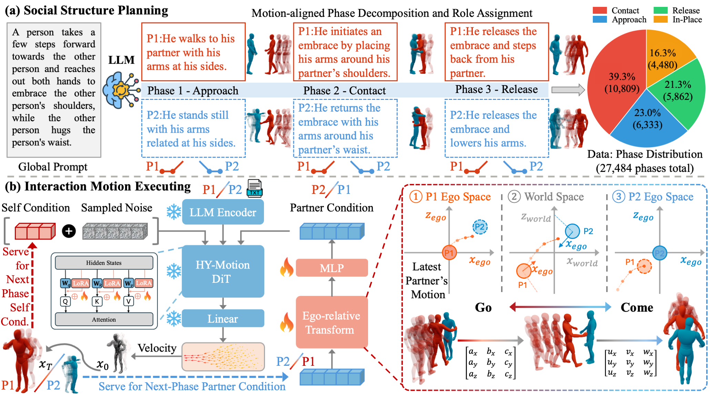

<div align="center">

# 🤝 SocialStructureHHI

**Social Structure Matters in 3D Human–Human Interaction Generation**

[](https://engineeringai-lab.github.io/SocialStructureHHI/)
[](https://arxiv.org/abs/2606.24255)
[](https://huggingface.co/EngineeringAI-LAB/SocialStructure)
[](https://huggingface.co/datasets/EngineeringAI-LAB/SocialStructure)
[](https://github.com/Tencent/HunyuanMotion)

</div>

---

## ✨ Overview

Generating two-person interactions — handshakes, hugs, hand-overs, fights — requires modeling
the **social structure** between the actors: who acts, who reacts, and how contact is formed and
released over time.

SocialStructureHHI decomposes a high-level goal into a sequence of **phases** via an LLM planner,
then generates each phase with a diffusion-transformer executor (on the
[HunyuanMotion](https://github.com/Tencent/HunyuanMotion) backbone) in an **ego-centric** frame,
alternating the two actors **Ping-Pong** style — P1 (Ping) acts first, P2 (Pong) reacts to P1's
freshly generated motion, with ego↔world tracking stitching the phases into a coherent episode.

<p align="center">
  
</p>

This repository releases the model: pretrained weights, the full text→motion inference pipeline,
and the data-preprocessing code.

## 🧩 Repository Structure

```
├── hhi/                       core library
│   ├── hhi_executor_model.py    HunyuanMotion backbone + HHI conditioning
│   ├── hhi_partner_model.py     + variable-length partner conditioning (run_030)
│   ├── hhi_state_machine.py     ego↔world transforms, Y-grounding
│   ├── hhi_constants.py         joint indices, contact thresholds, buckets, dataset paths
│   ├── hhi_types.py             dataclasses (PhaseSample, PhasePlan, …)
│   ├── hhi_duration_buckets.py  phase-length bucketization
│   ├── hhi_inpaint_sampling.py  prefix mask / overlap fusion
│   ├── hhi_schema.py            schema vocab + serialization
│   ├── hhi_dataset_builder.py   Inter-X H5 → ego-centric phase samples
│   └── interhuman_dataset_builder.py   InterHuman loaders
├── llm_interaction/           planner (phase decomposition) + prompts
├── inference/
│   ├── run_inference.py         full text→motion pipeline (entry point)
│   ├── infer_core.py            run_030 sampling + ego transforms + renderer
│   ├── text_encoders.py         online Qwen + CLIP encoders (match training cache)
│   ├── online_planner.py        receding-horizon LLM planner
│   └── assets/                  demo_global_texts.json, init_pose.npz
├── preprocess/                data pipeline (annotate → export → encode-text → norm-stats)
├── checkpoints/run_030/       best.pt  (weights — gitignored, host separately)
├── data/motion_norm_stats.npz dataset normalization stats (required by the model)
├── experiments/               train_030_config.json
└── docs/                      GitHub Pages project homepage
```

## 🚀 Quick Start

```bash
pip install -r requirements.txt

# The HunyuanMotion backbone + SMPL body model are not on PyPI:
git clone https://github.com/Tencent/HunyuanMotion        # or your local copy
export HUNYUAN_MOTION_ROOT=/path/to/HY-Motion-1.0

# Pretrained weights (🤗 https://huggingface.co/EngineeringAI-LAB/SocialStructure):
python -c "from huggingface_hub import hf_hub_download as d; \
import shutil, os; os.makedirs('checkpoints/run_030', exist_ok=True); \
shutil.copy(d('EngineeringAI-LAB/SocialStructure','ckpts/best.pt'), 'checkpoints/run_030/best.pt')"
```

The phase-decomposition **dataset** (motion + text `.h5`) lives at
🤗 https://huggingface.co/datasets/EngineeringAI-LAB/SocialStructure.

External assets expected under `$HUNYUAN_MOTION_ROOT/ckpts/`:
`HY-Motion-1.0-Lite/latest.ckpt` (backbone), `Qwen3-8B` (text encoder),
`clip-vit-large-patch14` (CLIP).

## 🎬 Inference (text → two-person motion)

The top-level `global_text` is **constrained to the training distribution**: pick one from the demo
list (sampled from Inter-X / InterHuman, the two datasets the model was trained on). The planner
expands it into concrete per-phase P1/P2 descriptions.

```bash
# 1. List the demo goals
python inference/run_inference.py --list

# 2. Generate from a demo goal (needs an LLM endpoint for the planner; ollama shown)
python inference/run_inference.py \
    --demo_id 5 \
    --llm_model qwen3.5:35b --llm_base_url http://localhost:11435/v1 \
    --out_dir outputs/handshake --render
```

Outputs: `outputs/<name>/motion.npz` (`p1`, `p2` world motion `[T, 201]`, `mask`, goal text and
planned phases) and, with `--render`, a standalone `vis.html` viewer. A custom goal can be forced
with `--allow_custom_global "<text>"`, but it is out-of-distribution and quality may degrade.

## 🛠️ Data Preprocessing

Set dataset paths in `hhi/hhi_constants.py` (`INTERX_*`) and
`hhi/interhuman_dataset_builder.py` (`INTERHUMAN_*`), then run the four stages (all shardable for
SLURM array jobs via `--shard_id` / `--num_shards`):

```bash
# 1. LLM annotation → phase-structured JSON cache  (needs an LLM endpoint)
python preprocess/annotate_interx.py      --cache_dir data/llm_annot_cache ...
python preprocess/annotate_interhuman.py  --cache_dir data/llm_annot_cache ...

# 2. Export raw motion → ego-centric per-phase .npz
python preprocess/export_interx.py      --split train --out_dir data/dataset_npz --cache_dir data/llm_annot_cache
python preprocess/export_interhuman.py  --split train --out_dir data/dataset_npz --cache_dir data/llm_annot_cache

# 3. Pre-encode phase text features (Qwen + CLIP)
python preprocess/encode_text_features.py --data_dir data/dataset_npz --split train \
    --qwen_path $HUNYUAN_MOTION_ROOT/ckpts/Qwen3-8B \
    --clip_path $HUNYUAN_MOTION_ROOT/ckpts/clip-vit-large-patch14 \
    --out_dir data/text_feat_cache

# 4. Compute dataset normalization stats
python preprocess/compute_norm_stats.py --train_dirs data/dataset_npz/train --out_path data/motion_norm_stats.npz
```

## 📐 Data Conventions

- **Motion dim**: 201 — root translation (3) + root 6D rotation (6) + 21 body-joint 6D rotations
  (126) + 22 forward-kinematics joint positions, root-relative (66).
- **Duration buckets** (frames @30fps): `[30, 60, 90, 120, 150, 180, 240, 300]`.
- **Normalization**: dataset mean/std from `data/motion_norm_stats.npz` (HunyuanMotion-shipped
  stats are *not* used — the distributions differ).
- **Self-history prefix**: each phase prepends 10 history frames pinned throughout sampling, which
  removes the train/inference mismatch of earlier variants.

## 📚 Citation

```bibtex
@misc{wang2026socialstructure,
  title  = {Social Structure Matters in 3D Human--Human Interaction Generation},
  author = {Zhongju Wang and Beier Wang and Yatao Bian and Pichao Wang and Zhi Wang
            and Daoyi Dong and Hongdong Li and Huadong Mo and Zhenhong Sun},
  year   = {2026},
  eprint = {2606.24255},
  archivePrefix = {arXiv},
  primaryClass  = {cs.CV}
}
```

## 🙏 Acknowledgements

Built on the [HunyuanMotion](https://github.com/Tencent/HunyuanMotion) backbone; trained on the
[Inter-X](https://liangxuy.github.io/inter-x/) and
[InterHuman](https://tr3e.github.io/intergen-page/) datasets. The project page adapts the
[Nerfies](https://github.com/nerfies/nerfies.github.io) template.

## License

Research code released for reproducibility. No license has been assigned; do not redistribute
without the authors' permission.
